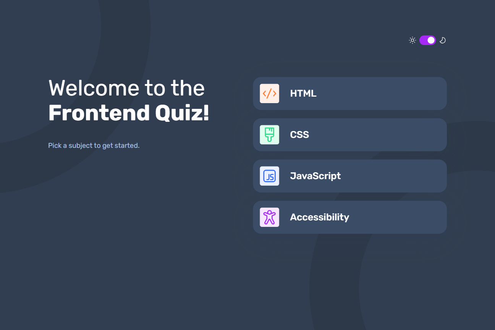
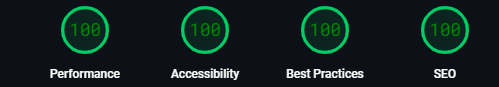

<div id="top"></div>

<div align="center">

  
  <br />
  <br />
  

  <h2 align="center">Frontend Quiz App With Theme Switcher</h2>
  <h3 align="center">React + TypeScript + Styled-Components</h3>
  <p align="center">
    <a href="https://www.frontendmentor.io/"><strong>Frontend Mentor Challenge</strong></a>
    <br />
    <br />
    <a href="https://frontend-quiz-app-main-amalitech.vercel.app/">View Demo</a>
    ·
    <a href="https://github.com/Zukizuk/frontend-quiz-app-main-amalitech" target="_blank">Report Bug</a>
    ·
    <a href="https://github.com/Zukizuk/frontend-quiz-app-main-amalitech" target="_blank">Request Feature</a>
  </p>
</div>

<!-- Bagdes -->
<div align="center">
  <!-- Profile -->
  <a href="https://www.frontendmentor.io/profile/Zukizuk">
    &nbsp;
  </a>
  <!-- Status -->
    <a href="#">
    
  </a>

</div>

This is a solution to the [Frontend quiz app challenge on Frontend Mentor](https://www.frontendmentor.io/challenges/frontend-quiz-app-BE7xkzXQnU). Frontend Mentor challenges help you improve your coding skills by building realistic projects.

## Table of contents

- [Overview](#overview)
  - [The challenge](#the-challenge)
  - [Screenshot](#screenshot)
  - [Links](#links)
- [My process](#my-process)
  - [Built with](#built-with)
  - [What I learned](#what-i-learned)
  - [Continued development](#continued-development)
  - [Useful resources](#useful-resources)
- [Author](#author)
- [Acknowledgments](#acknowledgments)

## Overview

### The challenge

Users should be able to:

- Select a quiz subject
- Select a single answer from each question from a choice of four
- See an error message when trying to submit an answer without making a selection
- See if they have made a correct or incorrect choice when they submit an answer
- Move on to the next question after seeing the question result
- See a completed state with the score after the final question
- Play again to choose another subject
- View the optimal layout for the interface depending on their device's screen size
- See hover and focus states for all interactive elements on the page
- Navigate the entire app only using their keyboard
- **Bonus**: Change the app's theme between light and dark

### Added Features

- Determine the theme of the app based on the user's system
- Added a slight animation with framer-motion
- Added a not found page to handle exceptional cases

### Screenshot



<br>

## Pagespeed Insights Score:

- |                                                                                                                                                                          |
  | :----------------------------------------------------------------------------------------------------------------------------------------------------------------------: |
  |                                        <b>Overall score 97% for Both Mobile & Desktop</b><br>(Below score is for desktop devices)                                        |
  |                                                                                                                                                                          |
  |                                                                                                  |
  |                                                                                                                                                                          |
  | Check out [**Pagespeed Insights**](https://pagespeed.web.dev/analysis/https-frontend-quiz-app-main-amalitech-vercel-app/a749x9q39x?form_factor=mobile) to get live score |
  |                                                                                                                                                                          |

<br>

### Links

- Solution URL: [Github Repo](https://github.com/Zukizuk/frontend-quiz-app-main-amalitech)
- Live Site URL: [Live](https://frontend-quiz-app-main-amalitech.vercel.app/)

## My process

### Built with

<!-- Bagdes -->


- Semantic HTML5 markup
- CSS custom properties
- Flexbox
- CSS Grid
- Mobile-first workflow
- [React](https://reactjs.org/) - JS library
- [Styled Components](https://styled-components.com/) - For styles

### What I learned

This project was a fantastic learning experience that significantly enhanced my web development skills. Through building this quiz app, I dove deep into the css-in-js library, styled-components, and I must say it's truly impressive. Styled-components offers remarkable control over styling, making it easy to implement dynamic styles based on component props or app state. It streamlined my workflow and made my components more self-contained and reusable.

Additionally, this project marked my first serious foray into using Figma and It was really a great learning experience. It was fun to develop a website with a figma design. I have always wanted to work with a figma design on projects like this from frontend mentor to attempt making a pixel perfect solution which I hope I have been able to achieve it in this project.

A styled-components powerful feature

```css
background-color: ${(props) =>
    props.theme.colors[props.subject.toLowerCase()]};
```

### Continued development

Though I was able to complete this project with styled-component I see that there are still concepts under it that I haven't been able to completely grasp so I intend to learn more about this amazing library and add it to my repertoire for styling. I also intend to familiarize myself more with figma as it is indeed a great tool to work with.

### Useful resources

- [React](https://react.dev/) - It allows you to create complex user interfaces using components, or small, self-contained pieces of code
- [styled-components](https://www.styled-components.com/) - Styled Components support dynamic styling through the use of JavaScript expressions within template literals.

## Author

- Frontend Mentor - [@Zukizuk](https://www.frontendmentor.io/profile/zukizuk)
- Linkedin: Marzuk Entsie - [Linkedin: Marzuk Entsie](https://linkedin.com/in/marzuk-entsie-0088aa2a8)

## Acknowledgments

### Run the project

First, run the development server:

```bash
npm run dev
# or
yarn dev
# or
pnpm dev
# or
bun dev
```

Open [http://localhost:5173](http://localhost:5173) with your browser to see the result.
